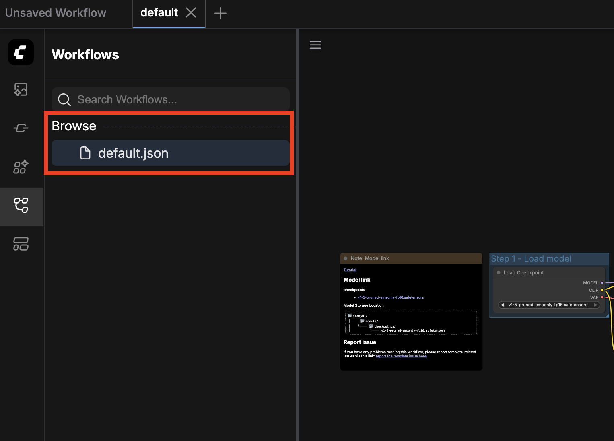

# Comfy Agent


Comfy Agent is a tool to use ComfyUI from the CLI.  
It is suitable for both direct CLI usage and AI-agent-driven automation.

Japanese documentation: [README.ja.md](./README.ja.md)

## QuickStart

The fastest way to try with local ComfyUI (`http://127.0.0.1:8188`) is below.

1. Install CLI

```bash
npm install -g comfy-agent
comfy-agent --help
```

2. Save ComfyUI `default` once in the browser UI



- Open ComfyUI in your browser (for example `http://127.0.0.1:8188`)
- Load the built-in `default` workflow and click **Save** once
- This makes it available as `default [remote]` from CLI

**Note: You need to save the workflow once in ComfyUI, otherwise `comfy-agent` cannot discover it.**

3. List and run it from CLI

```bash
comfy-agent list --source remote --base-url http://127.0.0.1:8188
comfy-agent run default --source remote --base-url http://127.0.0.1:8188 --prompt "A cat"
```

Generated files are saved under `.comfy-agent/outputs/<preset>/<timestamp>/` by default.

If you want to use your own workflow JSON instead, see the `import` section below.

If you use ComfyUI running on Google Colab, you can run it by specifying the URL with `--base-url`.

## Prerequisites

- Node.js 20+
- Running ComfyUI server (default: `http://127.0.0.1:8188`)

## Installation

From npm (recommended):

```bash
npm install -g comfy-agent
comfy-agent --help
```

From source (for contributors):

```bash
npm install
npm run build
npm run dev -- init
npm run dev -- list
```

## Work Directory

`comfy-agent init` creates `.comfy-agent/`:

```text
.comfy-agent/
  workflows/
  presets/
  outputs/
  cache/
```

### Global Scope

Use `--global` to switch to `~/.config/.comfy-agent`.

```bash
comfy-agent init --global
comfy-agent list --global
comfy-agent run text2img_v1 --global --prompt "A cat"
```

## ComfyUI Integration Flow

- POST `/prompt` with workflow JSON to enqueue
- Poll GET `/history/{prompt_id}` until done
- Read output `filename/subfolder/type` from history, then download via GET `/view`
- Upload input files to POST `/upload/image` or `/upload/mask` when needed
- During `import`, GET `/object_info` (if available) to improve type inference

## `base_url` Precedence

1. `--base-url`
2. `COMFY_AGENT_BASE_URL`
3. default `http://127.0.0.1:8188`

## Commands

### `init`

```bash
comfy-agent init
comfy-agent init --global
```

### `import`

Import a ComfyUI workflow API JSON and generate a preset template.

```bash
comfy-agent import ./workflow_api.json --name text2img_v1
comfy-agent import ./workflow_api.json --name text2img_v1 --base-url http://127.0.0.1:8188
comfy-agent import ./workflow_api.json --name text2img_v1 --global
```

Note: For this flow, export workflow API JSON from ComfyUI first. Direct import from the currently opened editor state is not supported.

If `/object_info` is available, inference is enhanced and cached at `.comfy-agent/cache/object_info.json`.

### `list`

```bash
comfy-agent list
comfy-agent list --json
comfy-agent list --global
comfy-agent list --source all
comfy-agent list --source remote --base-url http://127.0.0.1:8188
comfy-agent list --source remote-catalog --base-url http://127.0.0.1:8188
```

- `--source all`: `local + remote` (saved userdata workflows)
- `--source remote-catalog`: show catalog entries only when explicitly requested

Note: `remote-catalog` means templates already available in ComfyUI. Some of them cannot be executed directly via API, so save them once in ComfyUI and use them as remote saved workflows.

### `run`

```bash
comfy-agent run text2img_v1 --prompt "A cat" --steps 30
comfy-agent run text2img_v1 --prompt "A cat" --json
comfy-agent run text2img_v1 --prompt "A cat" --dry-run
comfy-agent run text2img_v1 --prompt "A cat" --n 3 --seed 42 --seed-step 1
comfy-agent run text2img_v1 --global --prompt "A cat"
comfy-agent run image_z_image_turbo --source remote-catalog --prompt "A cat" --base-url http://127.0.0.1:8188
```

With uploads:

```bash
comfy-agent run inpaint_v1 --prompt "fix" --init-image ./in.png --mask ./mask.png
```

Remote source notes:

- `--source remote` targets saved ComfyUI workflows from `userdata/workflows` (runnable path).
- `--source remote-catalog` targets template catalog entries (advanced/explicit use).
- Save workflows under ComfyUI `userdata/workflows` so they can be discovered by `list --source remote`.
- If the saved file is in ComfyUI UI format (`nodes`/`links`), it is converted to API prompt format automatically.
- Some UI-only nodes (for example notes) are ignored during conversion.
- For some catalog entries, workflow JSON may not be directly downloadable from API endpoints.
- If validation still fails for complex/custom graphs, export API JSON from ComfyUI and import it as a local preset.

### `doctor`

```bash
comfy-agent doctor
comfy-agent doctor --json
comfy-agent doctor --global
comfy-agent doctor --all-scopes
```

### `status`

Show currently resolved runtime settings (scope, base URL source, workdir state, preset count).

```bash
comfy-agent status
comfy-agent status --json
comfy-agent status --global
```

### `preset`

Show a user-friendly view of a preset definition.

```bash
comfy-agent preset text2img_v1
comfy-agent preset text2img_v1 --json
comfy-agent preset text2img_v1 --global
comfy-agent preset text2img_v1 --source local
comfy-agent preset text2img_v1 --source remote --base-url http://127.0.0.1:8188
```

### `analyze`

Analyze whether a generated image matches the instruction by using OpenAI image input.

```bash
export OPENAI_API_KEY=...
comfy-agent analyze ./output.png --prompt "A cat on a sofa"
comfy-agent analyze ./output.png --prompt "A cat" --json
comfy-agent analyze ./output.png --prompt "A cat" --out ./analysis.json
```

## Usage Notes

- Dynamic parameters use `--param value` (must match preset `parameters` names)
- Upload flags are defined in `uploads.*.cli_flag` (example: `--init-image`)
- `--dry-run` prints patched workflow JSON without calling API
- Default output path: `.comfy-agent/outputs/<preset>/<YYYYmmdd_HHMMSS>/`
- `run` logs the resolved output directory before execution and each saved file path
- `run` uses WebSocket progress by default; if the progress channel is lost, it automatically falls back to polling and continues monitoring
- Iteration uses `--n`; seed uses `--seed random` or `--seed <int> --seed-step <int>`
- Keep base URL out of presets and switch with `--base-url` or `COMFY_AGENT_BASE_URL`
- For multiple servers, use separate work directories
- Video outputs are saved according to `/history` output metadata
- `analyze` requires `OPENAI_API_KEY`
- Language can be switched with `--lang ja` or `COMFY_AGENT_LANG=ja` (default `en`)
- Remote workflow quick guide (English, user-facing): `docs/remote-workflow-resolution-quick.md`
- Remote workflow quick guide (Japanese, user-facing): `docs/remote-workflow-resolution-quick-ja.md`
- Remote workflow detailed spec (developer-facing): `docs/remote-workflow-resolution.md`

## Generate -> Analyze -> Adjust (Example)

1. Generate

```bash
comfy-agent run text2img_v1 --prompt "A cat on a sofa" --steps 30
```

2. Analyze

```bash
export OPENAI_API_KEY=...
comfy-agent analyze .comfy-agent/outputs/text2img_v1/20260203_120000/00001_123_1.png \
  --prompt "A cat on a sofa" --json
```

3. Adjust and regenerate

```bash
comfy-agent run text2img_v1 --prompt "A fluffy orange cat on a sofa" --steps 35
```

## Analyze Limits

- Supported image types: PNG/JPEG/WEBP/GIF (non-animated)
- Images larger than 8 MiB are rejected by the API path used here
- `--detail low` is cheaper but may reduce accuracy
- Video analysis is not supported yet (future: frame extraction)

## Preset Definition

```yaml
version: 1
name: text2img_v1
workflow: text2img_v1.json
parameters:
  prompt:
    type: string
    target:
      node_id: 12
      input: text
    required: true
  negative:
    type: string
    target:
      node_id: 13
      input: text
    default: ""
  steps:
    type: int
    target:
      node_id: 5
      input: steps
    default: 30
uploads:
  init_image:
    kind: image
    cli_flag: --init-image
    target:
      node_id: 21
      input: image
  mask:
    kind: mask
    cli_flag: --mask
    target:
      node_id: 22
      input: mask
```

## JSON Output

Use `--json` to print JSON-only output.

Success example:

```json
{
  "ok": true,
  "preset": "text2img_v1",
  "source": "local",
  "base_url": "http://127.0.0.1:8188",
  "scope": "local",
  "output_dir": ".comfy-agent/outputs/text2img_v1/20260203_120000",
  "runs": [
    {
      "index": 1,
      "prompt_id": "xxxxxxxx",
      "seed": 123,
      "outputs": [
        {
          "filename": "00001.png",
          "subfolder": "",
          "type": "output",
          "saved_to": ".comfy-agent/outputs/text2img_v1/20260203_120000/00001_123_1.png"
        }
      ],
      "duration_ms": 12345,
      "progress_events": [
        {
          "kind": "channel_connected",
          "timestamp": 1738900000000
        },
        {
          "kind": "execution_start",
          "timestamp": 1738900000100
        },
        {
          "kind": "progress",
          "timestamp": 1738900000200,
          "node": "3",
          "value": 5,
          "max": 20,
          "percent": 25
        }
      ]
    }
  ]
}
```

Error example:

```json
{
  "ok": false,
  "error": {
    "code": "MISSING_REQUIRED_PARAM",
    "message": "prompt is required",
    "details": {
      "param": "prompt"
    }
  }
}
```

## Exit Codes

- `0`: success
- `2`: user input error (missing param / type mismatch)
- `3`: API/network/server error

## Typical Errors

- `WORKDIR_NOT_FOUND`: run `comfy-agent init` first
- `INVALID_PRESET`: invalid YAML structure (`version/name/workflow`)
- `MISSING_REQUIRED_PARAM`: missing required parameter
- `API_ERROR`: server connection/response error; verify `base_url`
- `TIMEOUT`: increase `--timeout-seconds`
